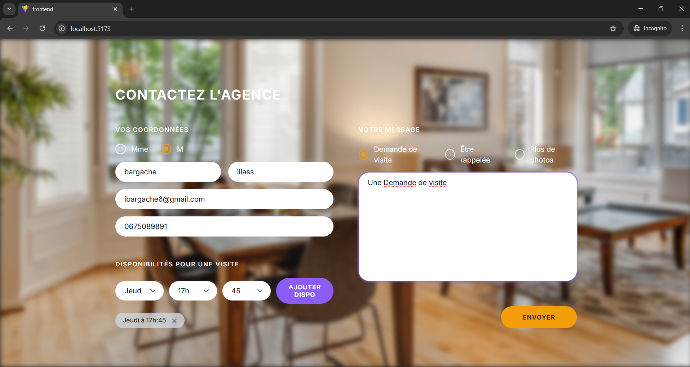

# TEST-TREMPLIN

## À propos de moi

**Nom :** ILIASS BARGACHE <br />
**Niveau d'étude :** freshement dipolomé BAC +5 / Ingénierie intelligente des systemes d'ifomations et communications <br />
**Durée du stage :** jusqu'au 6 mois selon vos besoins <br />
**École/Université :** École Supérieure de Management de Télécommunication et d’Informatique Sup MTI / freshement dipolomé <br />

---

## Screenshot



---

## Démarrage rapide

### Prérequis

- Docker & Docker Compose installés
- Git installé

### Installation

**Cloner le dépôt**

```bash
git clone https://github.com/itsmeiliass/test-tremplin
cd test-tremplin
```

**Configurer les variables d’environnement** </br>
Créez un fichier .env à la racine du projet

     ```bash

# Server Configuration

PORT=5000
NODE_ENV=development

# Database Configuration

POSTGRES_USER=postgres
POSTGRES_PASSWORD=123
POSTGRES_DB=test_tremplin
DB_HOST=db
DB_PORT=5432
DATABASE_URL=postgresql://postgres:123@db:5432/test_tremplin

````

**Lancer toute l’application avec Docker**
```bash
docker compose up --build
````

5. **Accéder à l'application**

```bash
Ouvrez votre navigateur sur http://localhost:3000
```

---

## Configuration

**Variables d'environnement**

Créez un fichier .env dans le dossier backend :

```bash
PORT=5000
DB_USER=postgres
DB_HOST=localhost
DB_NAME=test_tremplin
DB_PASSWORD=password
DB_PORT=5432
```

---

## Questions & Réponses

**Difficultés rencontrées** </br>
Intégration précise du design : Reproduire exactement le layout de l'image fournie a nécessité une attention particulière aux détails CSS

**Nouveaux outils découverts** </br>
React hot toast - pour l'alerte de Success .

**Choix des outils** </br>

React : Interface utilisateur moderne et réactive </br>
Express : API REST simple et efficace </br>
PostgreSQL : Base de données robuste et relationnelle </br>
Docker : Isolation et reproductibilité des environnements </br>
Vite : Build tool rapide pour le développement </br>

**Utilisation de Docker** </br>

Oui, j'utilise Docker régulièrement pour : </br>
Faciliter le déploiement </br>
Isoler les services

```

```
